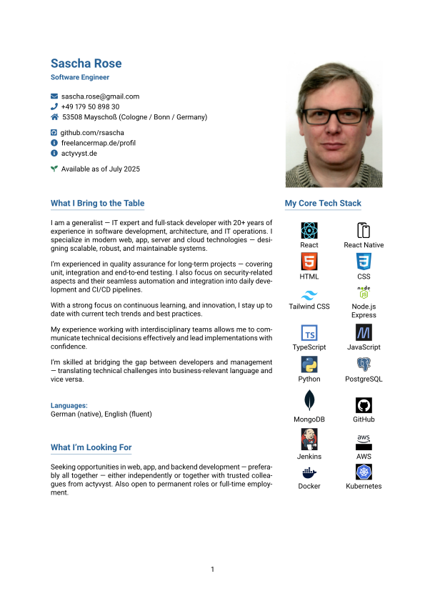
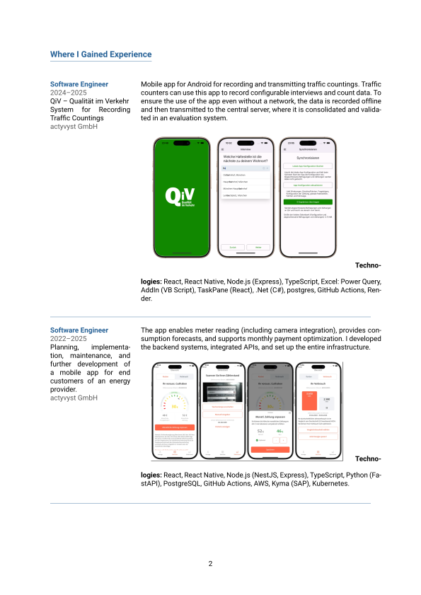
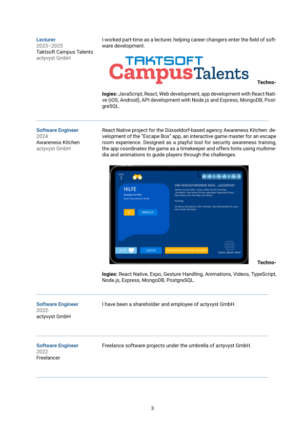
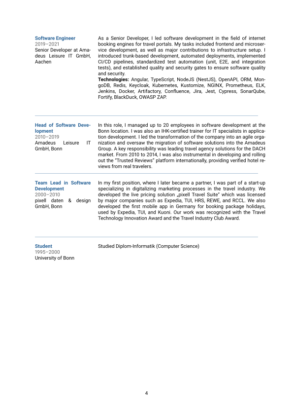

# CV Sascha Rose






## Development

Notes for setting up the development environment.

```sh
brew install basictex pdf2svg

sudo chown -R $(whoami) /usr/local/texlive/2025basic/
sudo chmod -R u+w /usr/local/texlive/2025basic/

tlmgr install titlesec
tlmgr install roboto
tlmgr install fontaxes
tlmgr install sectsty
tlmgr install collection-latexextra
```
